# WarezPlexThingy

TypeScript scraper that monitors warez.cx for new media releases, syncs findings to NocoDB, pushes downloads to JDownloader, and sorts completed downloads into Plex/Jellyfin media directories.

## How it works

A Fastify REST API server exposes all scraper modes as HTTP endpoints:

| Endpoint | What it does |
|---|---|
| `POST /api/search` | Queries the warez search API for each watchlist item to find media entries |
| `POST /api/enrich` | Fetches full release detail, applies filters, re-checks series for new episodes |
| `POST /api/push` | Sends matched downloads to JDownloader (filters episodes for series re-checks) |
| `POST /api/sort` | Sorts completed downloads into Plex/Jellyfin directory structure via FileBrowser |
| `POST /api/workflow` | Runs the full pipeline: search → enrich → push |
| `GET /api/health` | Health check |

### Match Status Flow

```
found → matched → pushed → processed
                ↑         |
                └─────────┘  (re-check finds new episode)
```

- **`found`** — entry identified by search scraper (no release data yet)
- **`matched`** — release matches all filters, has download links, ready for push
- **`pushed`** — links sent to JDownloader successfully
- **`processed`** — download sorted into media library by the sort step

The **search** scraper writes matches as `found`. The **enrich** scraper promotes them to `matched` after finding a release that passes all filters. It also re-checks series in `matched`, `pushed`, or `processed` states for new episodes — when found, it sets the match back to `matched` so it gets pushed again. The **push** scraper sends `matched` downloads to JDownloader (with metadata-encoded paths) and transitions them to `pushed`. The **sort** step moves completed downloads into the correct Plex/Jellyfin directory and transitions them to `processed`.

### Episode Filtering (Traffic Optimization)

For series season packs (e.g., `From.S04.GERMAN.DL.1080P.WEB.H264-WAYNE`), the crypted download container contains **all** episodes. When a new episode is found on a re-check, the push scraper avoids re-downloading already-fetched episodes:

1. Sends the container to JDownloader's **linkgrabber** (without autostart)
2. Polls the linkgrabber until individual file links are resolved (e.g., `From.S04E05.part1.rar`)
3. Filters links by episode pattern (keeps only `S04E05` files)
4. Removes old episode links from the linkgrabber
5. Moves only the new episode's files to the download list

Movies and first-time series matches still push with autostart as before.

### Media Sorting

When JDownloader completes a download, its EventScripter calls the sort endpoint. The download path contains encoded metadata (`{imdbId}-{type}[-{seasonEpisodeKey}]`) that the sort step uses to:

1. Look up the match in NocoDB by IMDB ID
2. Determine the correct destination (movies or shows directory)
3. Move video files (mkv, mp4, avi, etc.) and subtitles (srt, sub, ass, etc.) via FileBrowser's API
4. Skip sample files automatically
5. Rename movie files to the fulltitle from the matches table

**Directory structure:**

```
movies/
  Movie Title (2024)/
    Movie.Title.2024.German.DL.1080p.BluRay.x264-GROUP.mkv

shows/
  Show Title (2024)/
    S01/
      Show.Title.S01E02.Episode.Name.mkv           ← no subs
      Show.Title.S01E03.Episode.Name/               ← with subs
        Show.Title.S01E03.Episode.Name.mkv
        subs/
          subtitle.srt
```

### JDownloader EventScripter Setup

The sort endpoint is triggered automatically by a JDownloader EventScripter script. In JDownloader, go to **Settings → EventScripter** and add a new script with trigger **"Archive extraction finished"** (*Archiv-Entpacken beendet*):

```javascript
// Trigger: Archive extraction finished (Archiv-Entpacken beendet)

if (archive.getExtractionStatus() == "SUCCESSFUL") {
  // Strip the "/output/" prefix from the extraction path
  var rawFolder = archive.getFolder().toString();
  var cleanPath = rawFolder.replace(/^\/?output\//, "");

  var payloadObj = { downloadPath: cleanPath };
  var jsonPayload = JSON.stringify(payloadObj);

  try {
    // Replace with your server's IP/hostname (not localhost if JD runs in Docker)
    var response = postPage("http://your-server:3000/api/sort", jsonPayload);
    log("[EventScripter] Webhook sent. Response: " + response);
  } catch (error) {
    log("[EventScripter] Webhook error: " + error.toString());
  }
}
```

> **Note:** Replace the URL with your actual server address. If JDownloader runs in Docker, use the host's IP — not `localhost`.

## NocoDB Setup

Create three tables in NocoDB manually:

### `watchlist`
| Field | Type | Notes |
|---|---|---|
| `Title` | Text | Title to search for |
| `Type` | Single Select | `movie` or `series` |
| `ImdbId` | Text | Optional — enables precise matching |
| `TmdbId` | Number | Optional |
| `Quality` | Single Select | `720p`, `1080p`, `2160p` (leave blank for any) |
| `LangRequired` | Text | Comma-separated e.g. `GER,ENG` |
| `Tags` | Multi Select | AND filter against fulltitle (e.g. `HDR`, `WEB`, `H265`, uploader name) |
| `Season` | Number | Series season number (blank = any) |
| `LastEpisodeFound` | Number | Auto-updated — highest episode count matched so far |
| `Active` | Checkbox | Uncheck to pause monitoring |
| `DeactivateOnMatch` | Checkbox | Auto-deactivate movie items after first match |
| `LastMatchedAt` | DateTime | Auto-updated by scraper |
| `Notes` | Long Text | Free notes |

### `matches`
| Field | Type |
|---|---|
| `WatchlistId` | Number |
| `WarezId` | Number |
| `WarezUid` | Text |
| `Title` | Text |
| `Fulltitle` | Text |
| `Type` | Text |
| `Season` | Number |
| `Episode` | Number |
| `SeasonEpisodeKey` | Text (e.g. `S02E05`) |
| `Quality` | Text |
| `Lang` | Long Text (JSON) |
| `Links` | Long Text (JSON) |
| `CryptedLinks` | Long Text (JSON) |
| `SizeBytes` | Number |
| `ReleaseGroup` | Text |
| `ImdbId` | Text |
| `TmdbId` | Number |
| `WarezCreatedAt` | DateTime |
| `MatchedAt` | DateTime |
| `Status` | Single Select: `found`, `matched`, `pushed`, `processed` |

### `scraper_state`
| Field | Type |
|---|---|
| `key` | Text |
| `value` | Text |

## Configuration

Copy `.env.example` to `.env` and fill in your values:

```bash
cp .env.example .env
```

Key variables:

| Variable | Description |
|---|---|
| `NOCODB_URL` | NocoDB base URL, e.g. `http://localhost:8080` |
| `NOCODB_API_KEY` | NocoDB API token (from Team & Auth settings) |
| `NOCODB_WATCHLIST_TABLE_ID` | Table ID from NocoDB URL when viewing the table |
| `NOCODB_MATCHES_TABLE_ID` | Same for matches table |
| `NOCODB_STATE_TABLE_ID` | Same for state table |
| `SEARCH_DELAY_MS` | Delay between API queries in ms (default 1500) |
| `JDOWNLOADER_EMAIL` | MyJDownloader account email (required for `push` mode) |
| `JDOWNLOADER_PASSWORD` | MyJDownloader account password (required for `push` mode) |
| `JDOWNLOADER_DEVICE_NAME` | JDownloader device name (required for `push` mode) |
| `JDOWNLOADER_AUTOSTART` | Auto-start downloads in JDownloader (default: `false`) |
| `JDOWNLOADER_HOSTER_PRIORITY` | Comma-separated hoster preference (default: `ddownload,rapidgator`) |
| `API_PORT` | REST API server port (default: `3000`) |
| `FILEBROWSER_URL` | FileBrowser instance URL (required for `sort` mode) |
| `FILEBROWSER_USERNAME` | FileBrowser login username (required for `sort` mode) |
| `FILEBROWSER_PASSWORD` | FileBrowser login password (required for `sort` mode) |
| `FILEBROWSER_DOWNLOAD_PATH` | Download directory path in FileBrowser (required for `sort` mode) |
| `MEDIA_MOVIES_PATH` | Movies directory path in FileBrowser (required for `sort` mode) |
| `MEDIA_SHOWS_PATH` | TV shows directory path in FileBrowser (required for `sort` mode) |

### Finding your NocoDB Table IDs

Open a table in NocoDB — the URL will look like:
```
http://localhost:8080/dashboard/#/nc/p_xxx/table/md_yyy
```
The table ID is the `md_yyy` part.

## Running locally

```bash
# Install dependencies
npm install

# Set up environment
cp .env.example .env
# edit .env with your NocoDB credentials

# Run the API server in dev mode
npm run dev

# The server starts on http://localhost:3000 (or API_PORT)
# Trigger scrapers via HTTP:
#   PowerShell: Invoke-RestMethod -Method Post -Uri http://localhost:3000/api/workflow
#   curl:       curl.exe -X POST http://localhost:3000/api/workflow

# Or build first, then run
npm run build
npm start
```

### API Endpoints

```bash
# Full pipeline (search → enrich → push)
curl.exe -X POST http://localhost:3000/api/workflow

# Individual steps
curl.exe -X POST http://localhost:3000/api/search
curl.exe -X POST http://localhost:3000/api/enrich
curl.exe -X POST http://localhost:3000/api/push

# Sort a completed download
curl.exe -X POST http://localhost:3000/api/sort -H "Content-Type: application/json" -d "{\"downloadPath\": \"tt1234567-movie/Release.Name\"}"

# Health check
curl.exe http://localhost:3000/api/health
```

### Test scripts

```bash
npm run test:warez                            # Test warez.cx API connectivity
npm run test:warez -- --search "Breaking Bad" # Test search with a query
npm run test:nocodb                           # Test NocoDB connection
npm run test:match                            # Dry-run matcher against live data
npm run test:jdownloader                      # Test MyJDownloader connectivity
```

## Docker

### Prerequisites

- [Docker Desktop](https://www.docker.com/products/docker-desktop/) installed and running
- A `.env` file in the project root with your NocoDB credentials (see [Configuration](#configuration))

### Build and run

```bash
# From the project root (not the docker/ folder)
docker compose -f docker/docker-compose.yml build

# Start the container (API server + cron for scheduled workflow runs)
docker compose -f docker/docker-compose.yml up -d
```

### What happens on startup

1. The cron daemon starts in the background (runs workflow every 4 hours)
2. The Fastify API server starts on port 3000 (foreground process)
3. JDownloader webhooks and manual API calls can trigger scraping/sorting anytime

### Useful commands

```bash
# Check if the container is running
docker ps --filter name=warez-plex-scraper

# Follow the live logs (API server + scraper output)
docker logs -f warez-plex-scraper

# Manually trigger a full workflow via the API
curl -X POST http://localhost:3000/api/workflow

# Stop the container
docker compose -f docker/docker-compose.yml down

# Rebuild after code changes
docker compose -f docker/docker-compose.yml up -d --build
```

### Connecting to NocoDB in the same Docker network

If NocoDB runs in Docker too, uncomment the `networks` section in `docker/docker-compose.yml` and set `NOCODB_URL` to the container's internal hostname (e.g. `http://nocodb:8080`).

## Matching Logic

1. **IMDB/TMDB ID** — if both the watchlist item and the warez release carry an ID, it's compared exactly. This is the most reliable match.
2. **Normalized title** — lowercased, dots/dashes stripped, then compared. The release's `title` field (provided by warez, clean) and an extracted version of `fulltitle` are both checked.
3. **Quality filter** — tiers: `720p`, `1080p`, `2160p`. Set `Quality` to match only that exact quality tier.
4. **Language filter** — `LangRequired = GER,ENG` means the release must include both German and English audio.
5. **Tags filter** — all tags must appear in the release fulltitle (AND logic, case-insensitive). Use for format filters (`HDR`, `WEB`, `H265`) or to pin a specific uploader for consistent quality.
6. **Season filter** — for series, set `Season = 2` to only match season 2 releases.

### Episode Tracking

For series, the enrichment scraper tracks episodes via `episode_count_in_season` from the detail API:
- **Initial enrichment** (`found` → `matched`): compares against `LastEpisodeFound` in the watchlist
- **Re-checks** (series in `matched`/`pushed`/`processed`): compares against the match record's `Episode` field — if the detail API now reports more episodes, the match is updated and set back to `matched`
- `LastEpisodeFound` in the watchlist is always updated to the highest episode count seen

### Full Workflow Diagram

```mermaid
flowchart TD
    subgraph SEARCH["🔍 Search Scraper"]
        S1[Load active watchlist items] --> S2{Already has<br/>active match?}
        S2 -->|Yes| S3[Skip]
        S2 -->|No| S4[Search warez.cx API<br/>by IMDB ID or title]
        S4 --> S5{Results found?}
        S5 -->|No| S3
        S5 -->|Yes| S6{Type matches?<br/>IMDB/Title match?}
        S6 -->|No| S3
        S6 -->|Yes| S7[Create match record<br/>status = found]
    end

    subgraph ENRICH["📦 Enrich Scraper"]
        E1[Load found matches +<br/>series in matched/pushed/processed] --> E2[Fetch /start/d/:uid<br/>detail API]
        E2 --> E3{Release matches<br/>Quality/Tags/Lang<br/>Season filters?}
        E3 -->|No| E4[Skip]
        E3 -->|Yes| E5{Hoster online?<br/>check hide.cx SVG}
        E5 -->|All offline| E6[Try mirror<br/>same fulltitle,<br/>different uploader]
        E6 -->|No mirrors online| E4
        E5 -->|Online| E7{Series?}
        E6 -->|Mirror online| E7
        E7 -->|No| E8[Store links + crypted links<br/>status = matched]
        E7 -->|Yes| E9{episode_count ><br/>LastEpisodeFound?}
        E9 -->|No| E4
        E9 -->|Yes| E10[Update episode count<br/>Store links + crypted links<br/>status = matched]
    end

    subgraph PUSH["🚀 Push Scraper"]
        P1[Load matched records] --> P2{Series with<br/>episode tracking?}
        P2 -->|No| P3[Push crypted container<br/>to JDownloader<br/>with autostart]
        P2 -->|Yes| P4[Push crypted container<br/>WITHOUT autostart]
        P4 --> P5[Poll linkgrabber<br/>for resolved links]
        P5 --> P6[Filter links by<br/>episode pattern<br/>e.g. S04E05]
        P6 --> P7[Remove old episode<br/>links from linkgrabber]
        P7 --> P8[Move new episode<br/>links to download list]
        P3 --> P9[status = pushed]
        P8 --> P9
    end

    subgraph SORT["📁 Sort (webhook)"]
        T1[JDownloader completes<br/>download → calls /api/sort] --> T2[Parse metadata from<br/>download path<br/>imdbId-type-SxxExx]
        T2 --> T3[Look up match<br/>in NocoDB by IMDB ID]
        T3 --> T4{Movie or Series?}
        T4 -->|Movie| T5[Create: movies/Title Year/<br/>Rename video to fulltitle]
        T4 -->|Series| T6{Has subtitles?}
        T6 -->|No| T7[Move videos to:<br/>shows/Title Year/S01/]
        T6 -->|Yes| T8[Create episode subdir:<br/>shows/Title/S01/EpisodeDir/<br/>+ subs/ folder]
        T5 --> T9[Move video + subs<br/>via FileBrowser API]
        T7 --> T9
        T8 --> T9
        T9 --> T10[Delete source dir<br/>status = processed]
    end

    S7 --> E1
    E8 --> P1
    E10 --> P1
    P9 --> T1
```



## Project Structure

```
src/
  index.ts              Entry point — starts the Fastify API server
  server.ts             Fastify REST API with all endpoints
  config.ts             Env loading + validation
  matcher.ts            Title/quality/lang matching logic
  nocodb/
    client.ts           NocoDB REST API wrapper
    types.ts            Table row types
  warez/
    api.ts              warez.cx API client
    types.ts            API response types
  scrapers/
    search.ts           Search-based scraper
    enrich.ts           Detail enrichment + episode tracking + re-checks across all statuses
    push.ts             JDownloader push scraper (episode filtering + metadata path encoding)
    sort.ts             Media sorter — moves downloads to Plex/Jellyfin dirs via FileBrowser
  filebrowser/
    client.ts           FileBrowser REST API wrapper (X-Auth JWT)
  jdownloader/
    client.ts           MyJDownloader API wrapper
docker/
  Dockerfile
  docker-compose.yml
  crontab               Cron schedule (calls API endpoints via curl)
  entrypoint.sh         Container entrypoint (cron daemon + API server)
  run-scrape.sh         Runs workflow via API call
```
